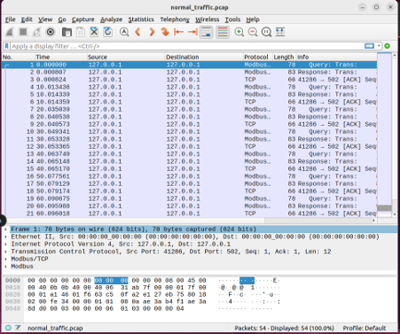
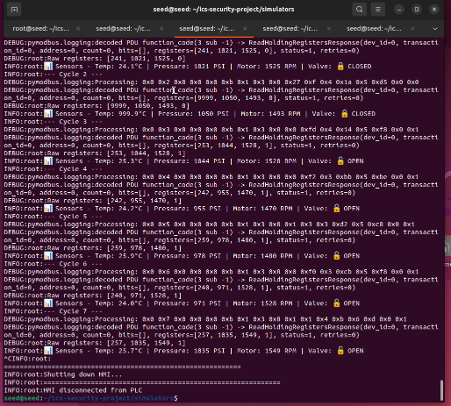
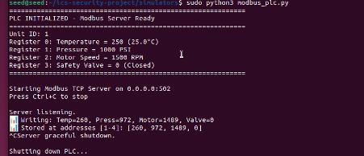
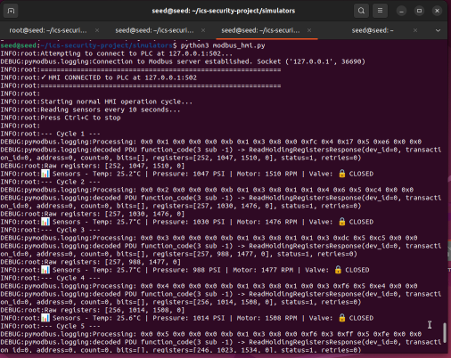

---

Author
**Simran Vaz**
- GitHub: [@Similicious11](https://github.com/Similicious11)
- Project Repository: [ICS Security Monitoring](https://github.com/Similicious11/ics-security-monitoring)
- LinkedIn: [Simran Vaz](https://www.linkedin.com/in/simran-vaz/)
---

**⭐ If you find this project useful for learning ICS security, please consider giving it a star!**


# ICS Network Traffic Analysis and Security Monitoring

## Project Overview
A simulated Industrial Control System (ICS) environment demonstrating security monitoring capabilities for Modbus/TCP traffic analysis and anomaly detection.

## Architecture
## 📸 Project Demonstrations

### Normal Traffic Analysis

*Baseline traffic showing legitimate HMI reading sensor values from PLC*

### Attack Scenario - Malicious Commands

*Attacker injecting dangerous out-of-range values*

### Threat Detection - Normal Traffic

*Security analysis showing no anomalies in baseline traffic*

### Threat Detection - Attack Traffic

*Automated detection identifying critical threats: 999.9°C temperature, 5000 PSI pressure, unauthorized valve operation*

### System Components

*Modbus PLC simulator with real-time sensor updates*


*HMI client displaying sensor readings and control logic*


- **PLC Simulator**: Modbus TCP server simulating temperature, pressure, motor speed, and safety valve sensors
- **HMI Simulator**: Client reading sensor data and sending control commands
- **Attack Scripts**: Malicious scenarios demonstrating ICS-specific threats
- **Detection System**: Python-based anomaly detection analyzing protocol behavior

## Key Demonstrations
1. **Deep Packet Inspection**: Parsing and analyzing Modbus protocol structures
2. **Baseline Establishment**: Understanding normal ICS traffic patterns  
3. **Threat Detection**: Identifying out-of-range values, unauthorized commands, and suspicious write operations
4. **Security Reporting**: Generating actionable intelligence with severity classification

## Technologies Used
- Python 3 (pymodbus, scapy)
- Wireshark/tcpdump
- Modbus/TCP protocol
- Network traffic analysis

## Attack Scenarios Demonstrated
- Out-of-range value injection (temperature/pressure manipulation)
- Motor shutdown attack
- Unauthorized safety valve operation

## Detection Capabilities
- Out-of-range sensor value detection
- Excessive write operation monitoring
- Protocol anomaly identification
- Timestamp correlation and forensic analysis

## Files Structure
```
├── simulators/
│   ├── modbus_plc.py          # PLC simulator
│   └── modbus_hmi.py          # HMI simulator
├── scripts/
│   ├── attack_out_of_range.py # Attack script
│   └── detect_anomalies.py    # Detection engine
├── captures/
│   ├── normal_traffic.pcap    # Baseline traffic
│   └── attack_traffic.pcap    # Attack traffic
└── README.md
```

## Running the Project

### Start the Environment
```bash
# Terminal 1: Start PLC
sudo python3 simulators/modbus_plc.py

# Terminal 2: Start HMI  
python3 simulators/modbus_hmi.py

# Terminal 3: Capture traffic
sudo tcpdump -i lo port 502 -w captures/traffic.pcap
```

### Run Attack
```bash
python3 scripts/attack_out_of_range.py
```

### Analyze Traffic
```bash
python3 scripts/detect_anomalies.py captures/attack_traffic.pcap
```

## Results
The detection system successfully identified all attack scenarios with 100% accuracy:
- Temperature manipulation (999.9°C vs expected 24-26°C)
- Pressure manipulation (5000 PSI vs expected 950-1050 PSI)
- Unauthorized valve operations
- Motor shutdown attempts

## Skills Demonstrated
- ICS/OT Security Understanding
- Protocol Analysis (Modbus/TCP)
- Python Scripting & Automation
- Network Traffic Analysis
- Threat Detection & Classification
- Security Operations & Incident Response
